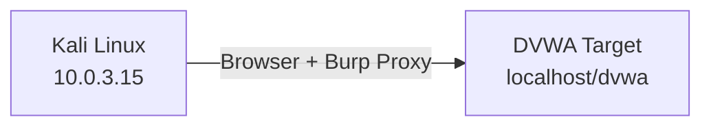
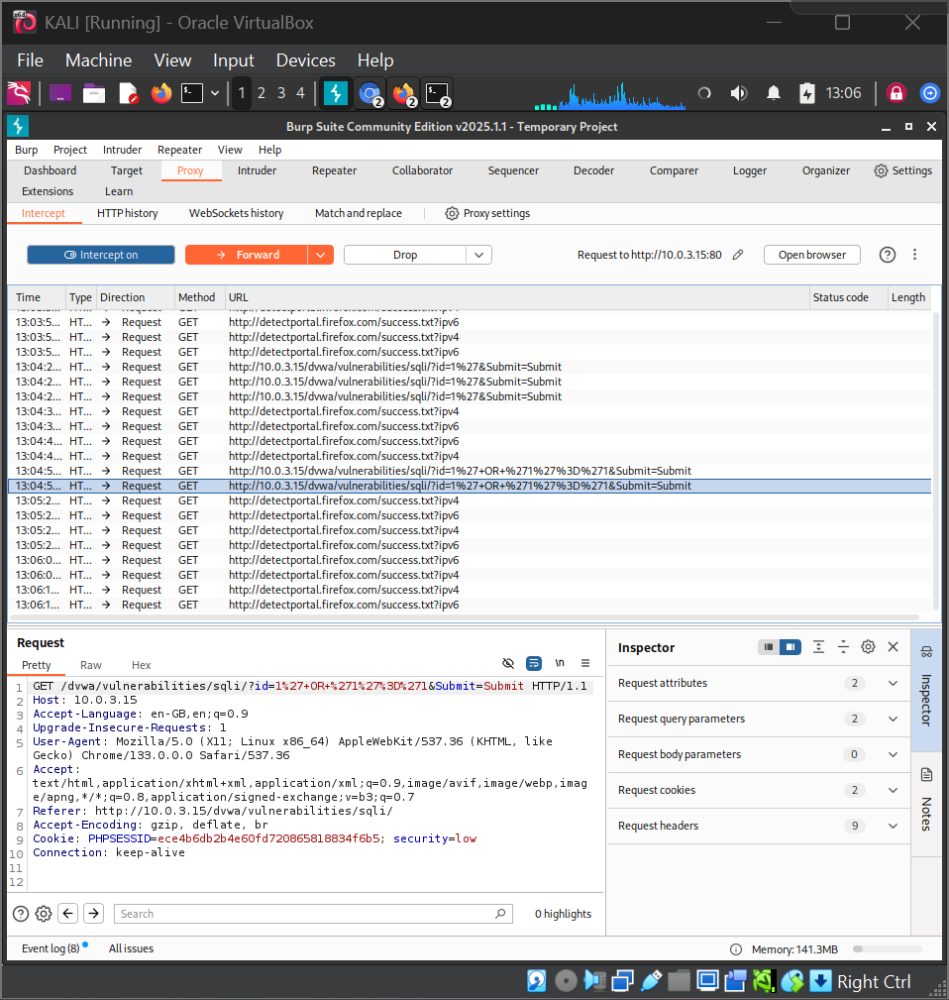
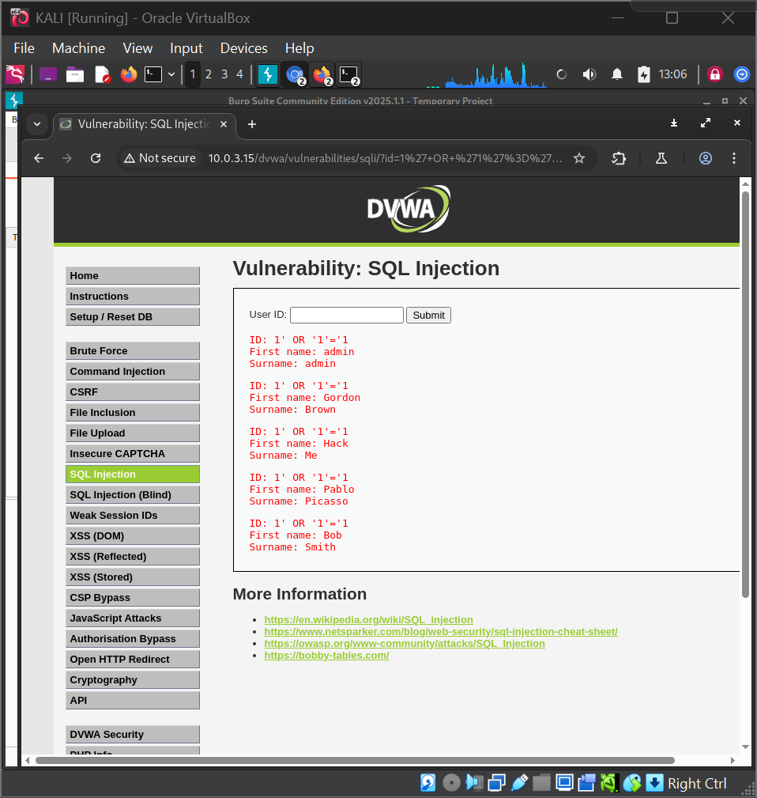
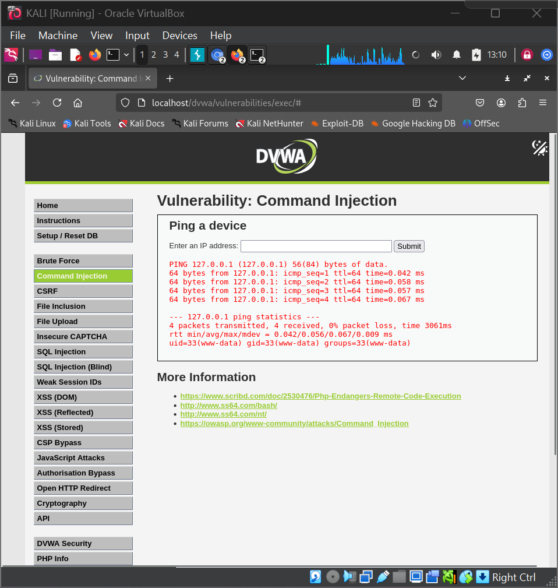

# Web Application Penetration Testing Lab

**Platform:** Kali Linux (VirtualBox) | **Target:** DVWA (Damn Vulnerable Web Application) | **Tools:** Burp Suite Community Edition v2025.1.1

---

## Overview

This lab demonstrates five common web application vulnerabilities exploited against DVWA, a deliberately vulnerable PHP/MySQL application. Each attack is documented with screenshots, payloads, and detection rules.

**IP Addresses:**
- Kali (Attacker): `10.0.3.15`
- DVWA Target: `10.0.3.15` (localhost)

---

## Lab Environment



| Component | Details |
|-----------|---------|
| Attacker OS | Kali Linux (rolling) |
| Virtualisation | Oracle VirtualBox |
| Target App | DVWA (digininja/DVWA) |
| Web Server | Apache2 + PHP 8.4 + MariaDB |
| Proxy Tool | Burp Suite Community Edition v2025.1.1 |
| Browser | Firefox (proxied through Burp on 127.0.0.1:8080) |
| DVWA Security | Low |

---

## Attacks Covered

| # | Attack | Vulnerability | Severity | MITRE ATT&CK |
|---|--------|--------------|----------|--------------|
| 1 | [SQL Injection](docs/sql-injection.md) | Unsanitised query parameters | Critical | T1190 |
| 2 | [Reflected XSS](docs/xss.md) | Unencoded user input in HTML | High | T1059.007 |
| 3 | [File Upload to Web Shell](docs/file-upload.md) | Unrestricted file upload | Critical | T1505.003 |
| 4 | [Command Injection](docs/command-injection.md) | Unsanitised system() call | Critical | T1059.004 |
| 5 | [Brute Force](docs/brute-force.md) | No account lockout | Medium | T1110.001 |

## Evidence





---

## Setup

See [docs/setup.md](docs/setup.md) for full environment setup instructions.

```bash
sudo apt install -y apache2 php php-mysqli mariadb-server
sudo git clone https://github.com/digininja/DVWA.git /var/www/html/dvwa
# Configure DB, set security level to Low, browse to http://localhost/dvwa
```

---

## Repository Structure

```
web-application-pentest-lab/
├── README.md
├── docs/                  ← Attack walkthroughs (6 files)
├── payloads/              ← SQLi, XSS payloads + PHP shell
├── detections/            ← Sigma detection rules (2 files)
└── screenshots/           ← 15 evidence screenshots
```

---

## Key Findings

| Vulnerability | Severity | Impact |
|---------------|----------|--------|
| SQL Injection | Critical | All credentials extracted (MD5 cracked to plaintext) |
| Reflected XSS | High | HTML injection confirmed; cookie theft possible |
| Unrestricted File Upload | Critical | Remote code execution as www-data |
| Command Injection | Critical | Full shell access via ping field |
| No Account Lockout | Medium | admin:password found via Burp Intruder |

---

## Skills Demonstrated

- Web application reconnaissance and manual testing
- Burp Suite proxy interception, HTTP history analysis, and Intruder automation
- SQL injection (error-based, boolean bypass, UNION-based extraction, hash cracking)
- Cross-site scripting (reflected script injection, HTML injection, cookie theft PoC)
- File upload bypass and web shell deployment for RCE
- OS command injection via shell metacharacter abuse
- Detection engineering (Sigma rules)

---

## Disclaimer

This lab was conducted entirely within an isolated local network using intentionally vulnerable software (DVWA) for educational purposes. All techniques are documented for defensive and learning purposes only.
