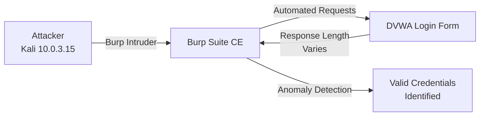
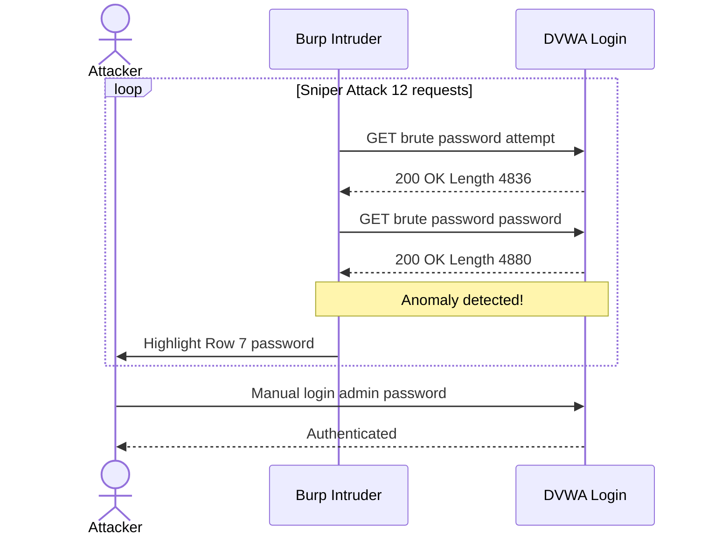

# Attack 5 -- Brute Force with Burp Suite Intruder

**DVWA Module:** Brute Force  
**Security Level:** Low  
**URL:** `http://localhost/dvwa/vulnerabilities/brute/`  
**Tool:** Burp Suite Community Edition v2025.1.1 -- Intruder  
**MITRE ATT&CK:** T1110.001 -- Brute Force: Password Guessing  
**CVSS v3.1 Score:** 5.3 (Medium)

---

## Objective

Use Burp Suite Intruder to automate credential guessing against the DVWA login form, demonstrating the impact of having no account lockout policy and the ability to distinguish successful from failed login attempts via response length analysis.

---

## Lab Environment



---

## Step 1 -- Capture the Login Request

With Burp Suite proxy active and intercept on, submit a login attempt on the DVWA Brute Force page with any credentials:

```
Username: admin
Password: test
```

| Evidence | Screenshot | Description |
|----------|----------- |-------------|
| Intruder Positions | [burp-intruder-positions.png](../screenshots/burp-intruder-positions.png) | Intruder Sniper with password position set |

Burp captures the GET request:
```http
GET /dvwa/vulnerabilities/brute/?username=admin&password=test&Login=Login HTTP/1.1
Host: 10.0.3.15
Cookie: PHPSESSID=ece4b6db2b4e60fd720865818834f6b5; security=low
```

---

## Step 2 -- Send to Intruder

In Burp Proxy --> HTTP History:
1. Right-click the captured request
2. Select **Send to Intruder**

Navigate to **Intruder** tab.

---

## Step 3 -- Configure Attack Positions

In the **Positions** tab:

1. Click **Clear section** to remove all auto-detected positions
2. Highlight the password value (`test`)
3. Click **Add section**

The request now shows:
```
GET /dvwa/vulnerabilities/brute/?username=admin&password=sectiontestsection&Login=Login
```

Attack type: **Sniper**

| Evidence | Screenshot | Description |
|----------|----------- |-------------|
| Intruder Positions | [burp-intruder-positions.png](../screenshots/burp-intruder-positions.png) | Password position marked with Sniper attack |

---

## Step 4 -- Configure Payloads

In the **Payloads** tab:

- Payload type: **Simple list**
- Payload count: **12**

Passwords added manually (simulating a small targeted wordlist):
```
123456
admin
password
letmein
welcome
123456
password
1234
password123
Mypassword
```

| Evidence | Screenshot | Description |
|----------|----------- |-------------|
| Intruder Payloads | [burp-intruder-payloads.png](../screenshots/burp-intruder-payloads.png) | 12-password list loaded into Intruder |

In a real engagement this would be loaded from `/usr/share/wordlists/rockyou.txt`.

---

## Step 5 -- Run the Attack

Click **Start attack**.

| Evidence | Screenshot | Description |
|----------|----------- |-------------|
| Intruder Results | [burp-intruder-results.png](../screenshots/burp-intruder-results.png) | Row 7 (`password`) with length 4880 highlighted |

Results table (all 12 requests):

| Request | Payload | Status | Length |
|---------|---------|--------|--------|
| 5 | welcome | 200 | 4837 |
| 6 | 123456 | 200 | 4836 |
| **7** | **password** | **200** | **4880** |
| 8 | 1234 | 200 | 4836 |
| 9 | password123 | 200 | 4837 |
| 10 | Mypassword | 200 | 4836 |

**Row 7 (`password`) has a response length of 4880 -- different from all others (4836--4837).** A longer response means the login succeeded and the application returned additional content (the authenticated dashboard).

---

## Step 6 -- Verify Credentials

The winning request (highlighted in Burp results):
```http
GET /dvwa/vulnerabilities/brute/?username=admin&password=password&Login=Login HTTP/1.1
```

Credentials confirmed: `admin : password`

### Intruder Attack Visualisation



---

## Why This Works

The DVWA login form has:
- No account lockout after failed attempts
- No CAPTCHA
- No rate limiting
- No progressive delay on failures
- No multi-factor authentication

All 12 requests return HTTP 200 (the form never returns 429 or 403), making automated guessing trivially easy. The only way to identify the correct password is by comparing response lengths.

---

## Remediation

### Secure Implementation
```php
// Account lockout after 5 failed attempts
if ($failed_attempts >= 5) {
    $lockout_time = 3600; // 1 hour
    block_account($username, $lockout_time);
}

// Progressive delay
sleep($failed_attempts * 2);

// CAPTCHA after 3 failed attempts
if ($failed_attempts >= 3) {
    require_captcha();
}
```

### Recommended Controls
| Control | Implementation |
|---------|---------------|
| **Account Lockout** | Lock after 5 failed attempts for 30 minutes |
| **Rate Limiting** | Max 5 login attempts per IP per minute |
| **CAPTCHA** | Google reCAPTCHA or hCaptcha integration |
| **Progressive Delay** | Multiply delay by failed attempt count |
| **Multi-Factor Auth** | Require TOTP/SMS for sensitive accounts |
| **Logging & Alerting** | Alert on >10 failed logins per minute per account |

---

## Finding Summary

| Field | Detail |
|-------|--------|
| **Vulnerability** | No account lockout / no brute-force protection |
| **Location** | Login form (`username`, `password` parameters) on `/vulnerabilities/brute/` |
| **Root Cause** | Missing rate limiting, lockout, and CAPTCHA controls |
| **Impact** | Complete credential compromise via automated guessing |
| **Tool** | Burp Suite Intruder (Sniper attack) |
| **Wordlist** | Manual 12-entry list (rockyou.txt in real engagement) |
| **Credentials Found** | `admin : password` |
| **Detection Signal** | Response length anomaly (4880 vs 4836) |
| **CVSS v3.1** | 5.3 (Medium) |
| **MITRE ATT&CK** | T1110.001 -- Brute Force: Password Guessing |

---

## Detection

### SIEM/Monitoring Indicators
- High volume of authentication requests from a single IP in a short time window
- Sequential requests with identical structure but different password values
- Multiple HTTP 200 responses to login endpoints where the vast majority should fail
- Response length/size anomalies in authentication endpoint responses
- User agent strings associated with automated tools (Burp, Hydra, Medusa)

### WAF/IPS Rules
```
# Example ModSecurity rule
SecRule REQUEST_URI "@contains /login" \
    "id:1004,phase:2,initcol:ip=%{REMOTE_ADDR},nolog,pass"

SecRule IP:LOGIN_ATTEMPTS "@gt 10" \
    "id:1005,deny,status:429,msg:'Too Many Login Attempts'"
```
