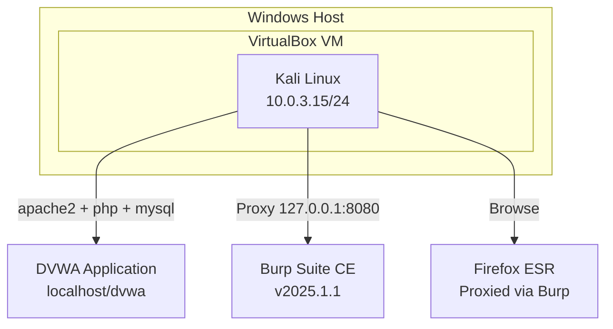
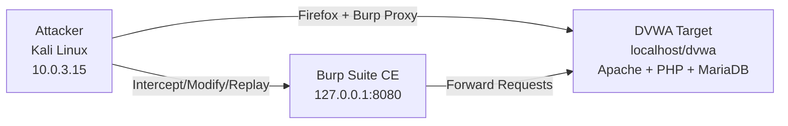

# Lab Setup

## Environment Overview

The lab runs entirely within VirtualBox on a Windows host, with Kali Linux as the attacking machine. DVWA is hosted locally on the Kali VM itself, simulating a web server on the internal network (`10.0.3.15`).



---

## Step 1 -- Install DVWA Dependencies

```bash
sudo apt install -y apache2 php php-mysqli mariadb-server
```

| Step | Screenshot | Description |
|------|----------- |-------------|
| 1 | [setup-dvwa-clone.png](../screenshots/setup-dvwa-clone.png) | DVWA git clone + database config commands via terminal |

Packages installed and upgraded:
- apache2, apache2-bin, apache2-data, apache2-utils
- mariadb-server, mariadb-client, mariadb-common
- php 8.4, php8.4-cli, php8.4-mysql, php8.4-common

---

## Step 2 -- Start Services

```bash
sudo systemctl start apache2
sudo systemctl start mariadb
```

---

## Step 3 -- Clone and Configure DVWA

```bash
cd /var/www/html
sudo git clone https://github.com/digininja/DVWA.git
sudo mv DVWA dvwa
sudo chmod -R 777 /var/www/html/dvwa
```

| Step | Screenshot | Description |
|------|----------- |-------------|
| Clone | [setup-dvwa-clone.png](../screenshots/setup-dvwa-clone.png) | Cloning DVWA repo and configuring permissions |

Cloning output confirms: 5746 objects, 2.76 MiB received.

---

## Step 4 -- Configure Database

```bash
sudo mysql -u root -e "
  CREATE DATABASE dvwa;
  CREATE USER 'dvwa'@'localhost' IDENTIFIED BY 'password';
  GRANT ALL ON dvwa.* TO 'dvwa'@'localhost';
  FLUSH PRIVILEGES;
"
```

---

## Step 5 -- Configure DVWA

```bash
cd /var/www/html/dvwa/config
sudo cp config.inc.php.dist config.inc.php
sudo nano config.inc.php
```

Change the following lines in `config.inc.php`:

```php
$_DVWA['db_user']     = 'dvwa';
$_DVWA['db_password'] = 'password';
$_DVWA['db_database'] = 'dvwa';
```

```bash
sudo systemctl restart apache2
```

---

## Step 6 -- Initial Login

Open Firefox on Kali and navigate to `http://localhost/dvwa/login.php`

```
Username: admin
Password: password
```

Click **Create / Reset Database** on the setup page.

| Step | Screenshot | Description |
|------|----------- |-------------|
| Login | [setup-dvwa-login.png](../screenshots/setup-dvwa-login.png) | DVWA login page with admin credentials |

---

## Step 7 -- Set Security Level to Low

Navigate to **DVWA Security** in the left menu.

Select **Low** from the dropdown and click **Submit**.

Confirmation: `Security level set to low`

| Step | Screenshot | Description |
|------|----------- |-------------|
| Security | [setup-security-level-low.png](../screenshots/setup-security-level-low.png) | DVWA Security level configured to Low |

---

## Step 8 -- Configure Burp Suite Proxy

Launch Burp Suite Community Edition:

```bash
burpsuite &
```

In Firefox, go to **Settings --> Network Settings --> Manual proxy**:

```
HTTP Proxy: 127.0.0.1    Port: 8080
```

| Step | Screenshot | Description |
|------|----------- |-------------|
| Proxy | [setup-firefox-proxy.png](../screenshots/setup-firefox-proxy.png) | Firefox proxy configured for Burp intercept |
| History | [burp-history-first-dvwa-request.png](../screenshots/burp-history-first-dvwa-request.png) | Burp HTTP History capturing first DVWA request |

Burp Suite HTTP History confirms traffic from the browser is now being intercepted at `http://10.0.3.15:80`.

---

## Network Configuration

```
Kali VM (eth1):  10.0.3.15/24
                 inet6 fd17:625c:f037:3:5049:f721:a5e:13f6/64
Gateway:         10.0.3.255
```

The DVWA instance is accessible both via `localhost/dvwa` (direct) and `10.0.3.15/dvwa` (via Burp proxy on the network interface).

---

## Lab Topology



---

## Verification Checklist

- [x] `http://localhost/dvwa` loads login page
- [x] Login with admin/password succeeds
- [x] Database created/reset successfully
- [x] Security level set to **Low**
- [x] Burp Suite intercepts requests from Firefox
- [x] HTTP History shows DVWA requests at `10.0.3.15`
