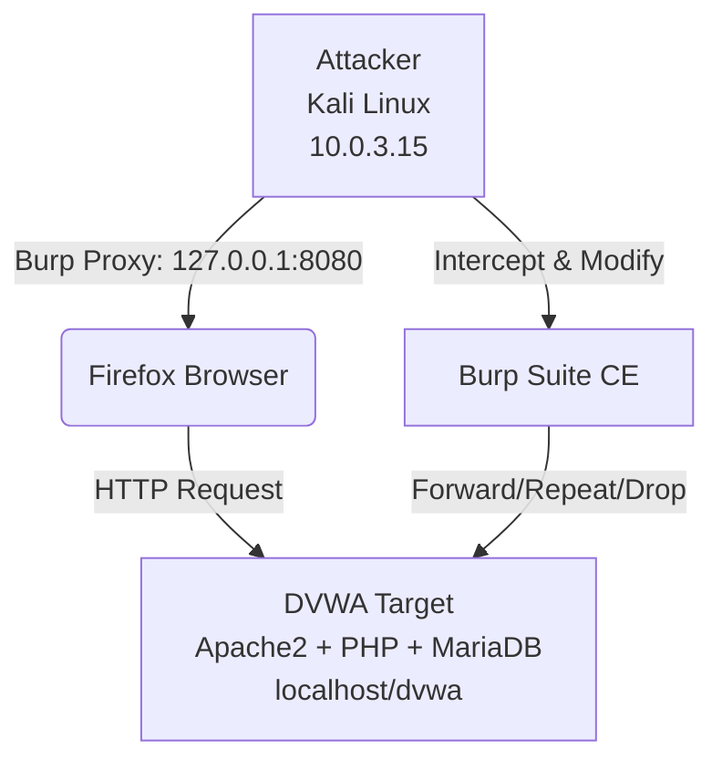
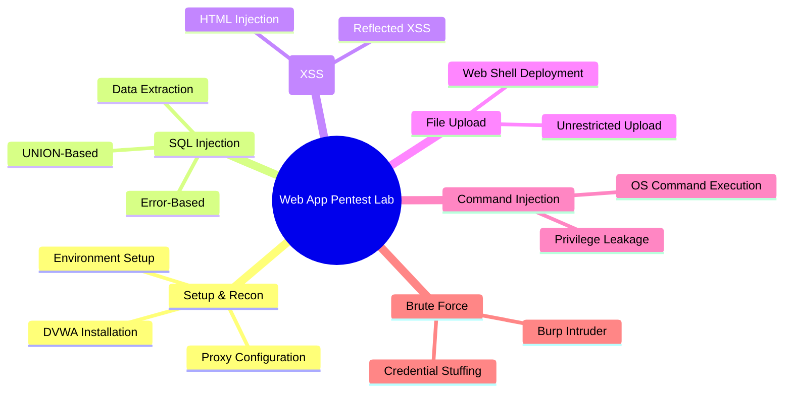
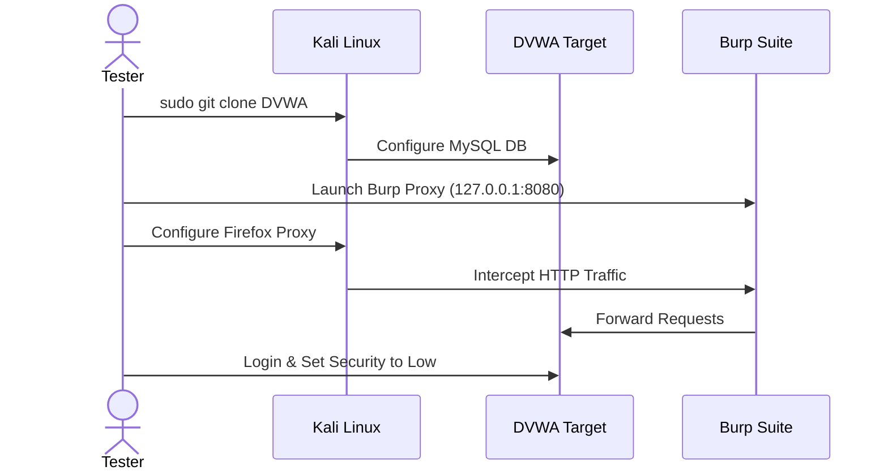
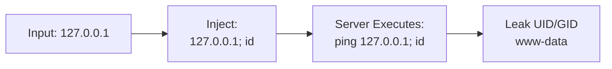
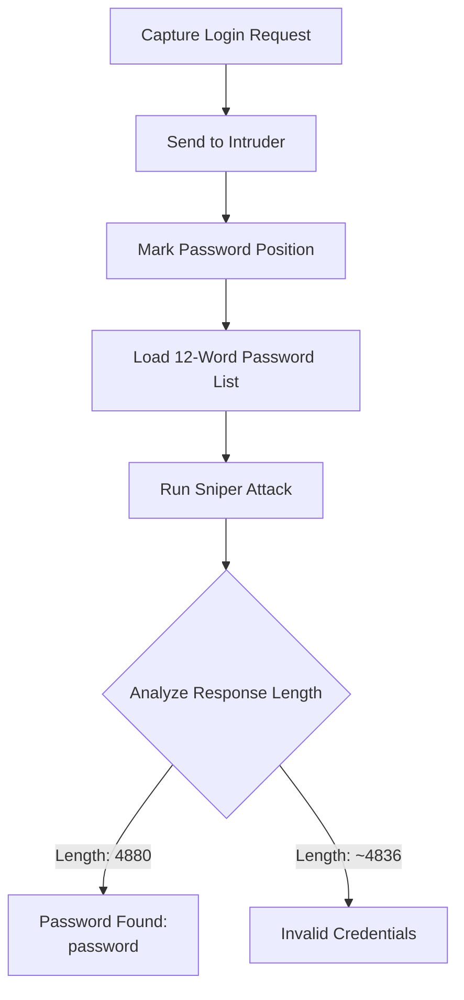

# Screenshots Evidence Gallery

> **Lab Date:** 2026-06-11  
> **Platform:** Kali Linux (VirtualBox) | **Target:** DVWA (Damn Vulnerable Web Application) | **Tool:** Burp Suite Community Edition v2025.1.1  
> **Scope:** Web Application Penetration Testing in an isolated lab environment.

---

## Lab Network Architecture



---

## Evidence Index

### Attack Coverage Matrix



---

## 1. Environment Setup & Configuration

| # | Filename | Description | Tool Used |
|---|----------|-------------|-----------|
| 1.1 | [setup-dvwa-clone.png](setup-dvwa-clone.png) | DVWA git clone + database config commands via terminal | Git, MySQL |
| 1.2 | [setup-dvwa-login.png](setup-dvwa-login.png) | DVWA login page at `localhost/dvwa/login.php` | Firefox |
| 1.3 | [setup-firefox-proxy.png](setup-firefox-proxy.png) | Firefox proxy configured to route traffic through `127.0.0.1:8080` | Firefox |
| 1.4 | [burp-history-first-dvwa-request.png](burp-history-first-dvwa-request.png) | Burp HTTP History capturing the first intercepted DVWA request | Burp Suite |
| 1.5 | [setup-security-level-low.png](setup-security-level-low.png) | DVWA Security level explicitly set to **Low** for vulnerability testing | DVWA |

### Setup Evidence Flow



---

## 2. SQL Injection (SQLi)

> **Objective:** Demonstrate error-based and UNION-based SQL injection to extract database contents.
> **Severity:** Critical | **MITRE ATT&CK:** T1190

| # | Filename | Description | Technique |
|---|----------|-------------|-----------|
| 2.1 | [sqli-burp-intercept.png](sqli-burp-intercept.png) | Burp intercepting malicious GET request with payload `id=1'` | Interception |
| 2.2 | [sqli-burp-history-injection.png](sqli-burp-history-injection.png) | Burp HTTP History log showing repeated injection payloads | Traffic History |
| 2.3 | [sqli-all-users-localhost.png](sqli-all-users-localhost.png) | Successful extraction of all 5 user records via `OR 1=1` | Error-Based SQLi |

### SQLi Attack Chain

```mermaid
flowchart LR
    A[User Input<br/>id=1'] --> B{Backend Query}<br/>SELECT * FROM users WHERE id = '1''<br/><i>Syntax Error Triggered</i>]
    B --> C[Confirm Vulnerability]
    C --> D[Craft Payload:<br/>OR 1=1 -- -]
    D --> E[Extract All Data<br/>5 Users Dumped]
```

---

## 3. Cross-Site Scripting (XSS)

> **Objective:** Perform reflected XSS attacks by injecting malicious scripts into user input fields.
> **Severity:** High | **MITRE ATT&CK:** T1059.007

| # | Filename | Description | Technique |
|---|----------|-------------|-----------|
| 3.1 | [xss-script-input.png](xss-script-input.png) | Injection of `<script>alert('XSS')</script>` in the name field | Script Injection |
| 3.2 | [xss-html-inject.png](xss-html-inject.png) | HTML injection displaying `<h1>Hacked</h1>` rendered in the page | HTML Injection |

### XSS Payload Execution

```mermaid
sequenceDiagram
    actor Attacker
    participant Browser as Firefox
    participant DVWA as DVWA Target
    
    Attacker->>Browser: Input: &lt;script&gt;alert('XSS')&lt;/script&gt;
    Browser->>DVWA: Submit Form (name parameter)
    DVWA->>DVWA: Reflect Input without Sanitization
    DVWA->>Browser: Return Page with Embedded Script
    Browser->>Browser: Execute Script<br/>alert('XSS')
```

---

## 4. File Upload Vulnerability

> **Objective:** Exploit unrestricted file upload to deploy a PHP web shell and achieve Remote Code Execution (RCE).
> **Severity:** Critical | **MITRE ATT&CK:** T1505.003

| # | Filename | Description | Technique |
|---|----------|-------------|-----------|
| 4.1 | [file-upload-shell-create.png](file-upload-shell-create.png) | Creation of `test.php` shell using `echo` in terminal | Web Shell Preparation |

---

## 5. Command Injection

> **Objective:** Exploit unsanitized system calls to execute arbitrary OS commands on the server.
> **Severity:** Critical | **MITRE ATT&CK:** T1059.004

| # | Filename | Description | Technique |
|---|----------|-------------|-----------|
| 5.1 | [command-injection-ping.png](command-injection-ping.png) | `ping 127.0.0.1` output revealing `uid=33(www-data)` and `gid=33(www-data)` | OS Command Injection |

### Command Injection Chain



---

## 6. Brute Force Attack (Burp Intruder)

> **Objective:** Leverage Burp Suite Intruder to perform credential stuffing and identify valid passwords.
> **Severity:** Medium | **MITRE ATT&CK:** T1110.001

| # | Filename | Description | Technique |
|---|----------|-------------|-----------|
| 6.1 | [burp-intruder-positions.png](burp-intruder-positions.png) | Intruder Sniper attack with password position set | Positional Attack |
| 6.2 | [burp-intruder-payloads.png](burp-intruder-payloads.png) | Payload list (12 passwords) loaded into Intruder | Dictionary Attack |
| 6.3 | [burp-intruder-results.png](burp-intruder-results.png) | Results table - row 7 (`password`) has a distinct response length of 4880 | Result Analysis |

### Intruder Attack Flow



---

## Summary of Findings

| Vulnerability | Severity | Impact | Evidence |
|---------------|----------|--------|----------|
| **SQL Injection** | Critical | Complete database dump of user credentials | `sqli-all-users-localhost.png` |
| **Reflected XSS** | High | Session hijacking / cookie theft possible | `xss-script-input.png`, `xss-html-inject.png` |
| **File Upload** | Critical | Remote Code Execution as `www-data` | `file-upload-shell-create.png` |
| **Command Injection** | Critical | Full server shell access via arbitrary OS commands | `command-injection-ping.png` |
| **Brute Force** | Medium | Admin account compromised (`admin:password`) | `burp-intruder-results.png` |

---

## Disclaimer

> **This lab was conducted entirely within an isolated local network using intentionally vulnerable software (DVWA) for educational and defensive training purposes. The techniques demonstrated are documented strictly for learning and defensive awareness.**
